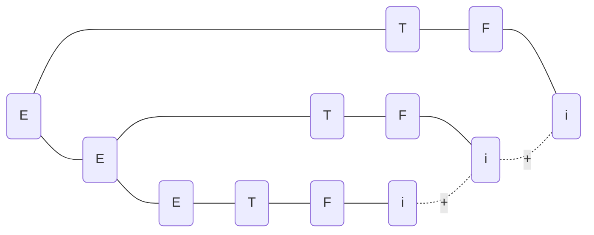
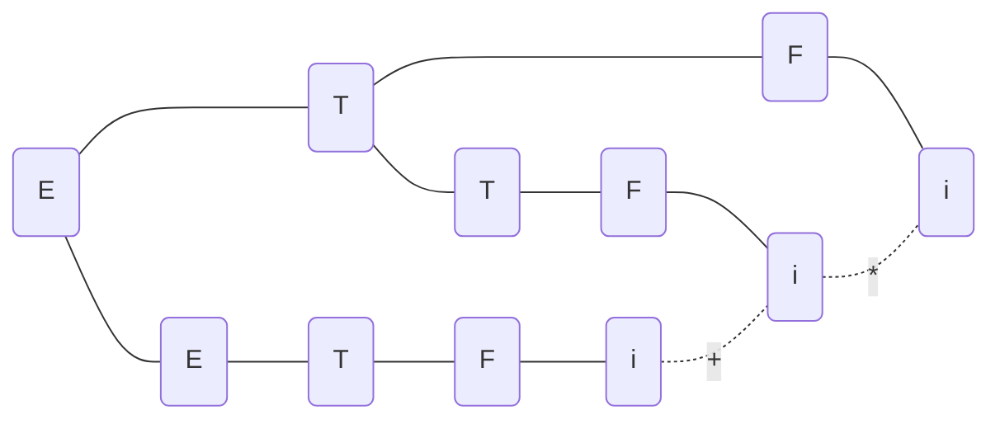
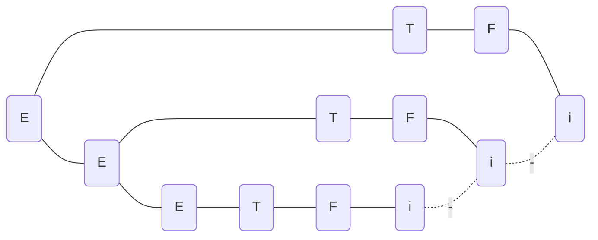

# 第二章 高级语言及其语法描述

[TOC]

## P36 6

### 题目

令文法$G_6$为:

$$N\rightarrow D|ND$$
$$D\rightarrow 0|1|2|3|4|5|6|7|8|9$$

1. $G_6$的语言$L(G_6)$是什么?
2. 给出句子 0127、34 和 568 的最左推导和最右推导。

### 解答

1. 是由0~9构成的数字串
2. 0127的最左推导
   $$N\rightarrow ND\rightarrow NDD\rightarrow NDDD\rightarrow DDDD\rightarrow 0DDD\rightarrow 01DD\rightarrow 012D\rightarrow 0127$$

   0127的最右推导
   $$N\rightarrow ND\rightarrow N7\rightarrow ND7\rightarrow N27\rightarrow ND27\rightarrow N127\rightarrow D127\rightarrow 0127$$

   34的最左推导
   $$N\rightarrow ND\rightarrow DD\rightarrow 3D\rightarrow 34$$

   34的最右推导
   $$N\rightarrow ND\rightarrow N4\rightarrow D4\rightarrow 34$$

   568的最左推导
   $$N\rightarrow ND\rightarrow NDD\rightarrow DDD\rightarrow 5DD\rightarrow 56D\rightarrow 568$$

   568的最右推导
   $$N\rightarrow ND\rightarrow N8\rightarrow ND8\rightarrow N68\rightarrow D68\rightarrow 568$$

## P36 8

### 题目

令文法为
$E\rightarrow T|E+T|E-T$
$T\rightarrow F|T*F|T/F$
$F\rightarrow (E)|i$

1. 给出$i+i*i$、$i*(i+i)$的最左推导和最右推导;
2. 给出$i+i+i$、$i+i*i$和$i-i-i$的语法树。

### 解答

$i+i*i$的最左推导
$$E\rightarrow E+T\rightarrow T + T\rightarrow F + T\rightarrow i + T\rightarrow i + T*F\rightarrow i+i*F\rightarrow i+i*i$$

$i+i*i$的最右推导
$$E\rightarrow E+T\rightarrow E+T*F\rightarrow E+T*i\rightarrow E+F*i\rightarrow E+i*i\rightarrow T+i*i\rightarrow i+i*i$$

$i*(i+i)$的最左推导
$$T\rightarrow T*F\rightarrow F*F\rightarrow i*F\rightarrow i*(E)\rightarrow i*(E+T)\rightarrow i*(T+T)\rightarrow i*(F+T)\rightarrow i*(i+T)\rightarrow i*(i+F)\rightarrow i*(i+i)$$

$i*(i+i)$的最右推导
$$T\rightarrow T*F\rightarrow T*(E)\rightarrow T*(E+T)\rightarrow T*(E+F)\rightarrow T*(E+i)\rightarrow T*(T+i)\rightarrow T *(F+i)\rightarrow T*(i+i)\rightarrow F*(i+i)\rightarrow i*(i + i)$$

$i+i+i$的语法树

$i+i*i$的语法树

$i-i-i$的语法树

## P36 9

### 题目

证明下面的文法是二义的:

$$S\rightarrow iSeS|iS|i$$

### 解答

最左推导:
$$S\rightarrow iS\rightarrow iiSeS\rightarrow iiieS\rightarrow iiiei$$
$$S\rightarrow iSeS\rightarrow iiSeS\rightarrow iieS\rightarrow iieii$$

最右推导:
$$S\rightarrow iS\rightarrow iiSeS\rightarrow iiSei\rightarrow iiiei$$
$$S\rightarrow iSeS\rightarrow iSei\rightarrow iiSei\rightarrow iiiei$$

## P36 10

### 题目

把下面的文法改写为无二义的:

$$S\rightarrow SS|(S)|()$$

### 解答

$$S\rightarrow ST|T$$
$$T\rightarrow (S)|()$$
