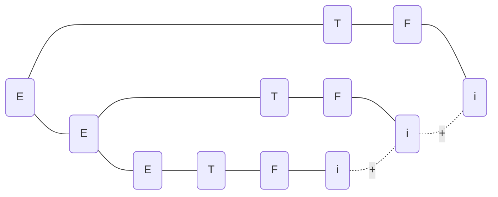
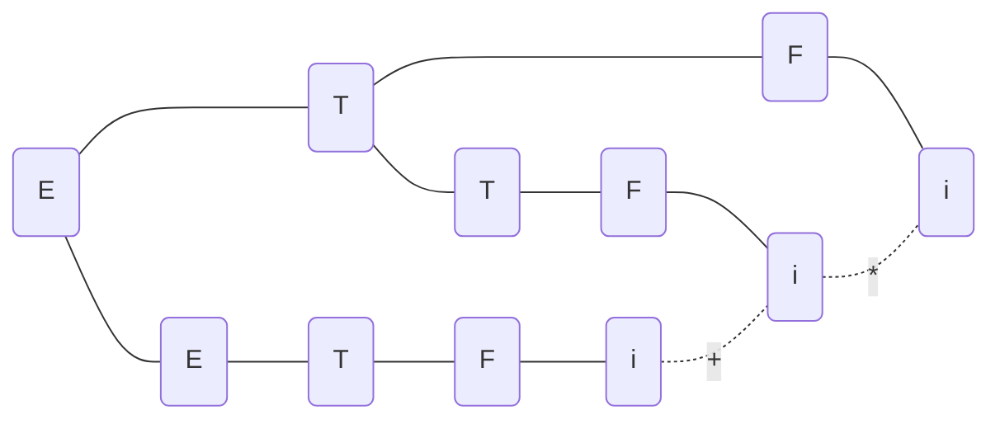
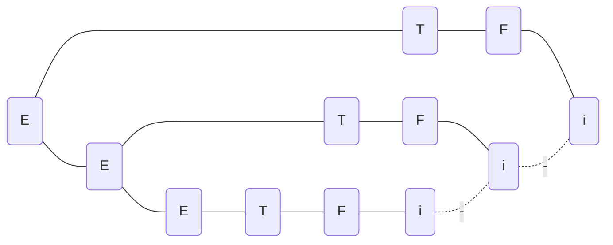

# 第二章 高级语言及其语法描述

[TOC]

## P36 6

### 题目

令文法$G_6$为:

$N\rarr$$D|ND$
$D\rarr0|1|2|3|4|5|6|7|8|9$

1. $G_6$的语言$L(G_6)$是什么?
2. 给出句子 0127、34 和 568 的最左推导和最右推导。

### 解答

1. > $是由0~9构成的数字串$
2. > 0127的最左推导
   > $N \rarr ND \rarr NDD \rarr NDDD \rarr DDDD \rarr 0DDD \rarr 01DD \rarr 012D \rarr 0127$
   >
   > 0127的最右推导
   > $N \rarr ND \rarr N7 \rarr ND7 \rarr N27 \rarr ND27 \rarr N127 \rarr D127 \rarr 0127$
   >
   > 34的最左推导
   > $N \rarr ND \rarr DD \rarr 3D \rarr 34$
   >
   > 34的最右推导
   > $N \rarr ND \rarr N4 \rarr D4 \rarr 34$
   >
   > 568的最左推导
   > $N \rarr ND \rarr NDD \rarr DDD \rarr 5DD \rarr 56D \rarr 568$
   >
   > 568的最右推导
   > $N \rarr ND \rarr N8 \rarr ND8 \rarr N68 \rarr D68 \rarr 568$

## P36 8

### 题目

令文法为
$E \rarr T|E+T|E-T$
$T \rarr F|T*F|T/F$
$F \rarr (E)|i$

1. 给出$i+i*i$、$i*(i+i)$的最左推导和最右推导;
2. 给出$i+i+i$、$i+i*i$和$i-i-i$的语法树。

### 解答

1. > $i+i*i$的最左推导
   > $E \rarr E+T \rarr T + T \rarr F + T \rarr i + T \rarr i + T*F \rarr i+i*F \rarr i+i+i$
   >
   > $i+i*i$的最右推导
   > $E \rarr E+T \rarr E+T*F \rarr E+T*i \rarr E+F*i \rarr E+i*i \rarr T+i*i \rarr i+i*i$
   >
   > $i*(i+i)$的最左推导*
   > $T \rarr T*F \rarr F*F \rarr i*F \rarr i*(E) \rarr i*(E+T) \rarr i*(T+T) \rarr i*(F+T) \rarr i*(i+T) \rarr i*(i+F) \rarr i*(i+i)$
   >
   > $i*(i+i)$的最右推导
   >$T \rarr T*F \rarr T*(E) \rarr T*(E+T) \rarr T*(E+F) \rarr T*(E+i) \rarr T*(T+i) \rarr T *(F+i) \rarr T*(i+i) \rarr F*(i+i) \rarr i*(i + i)$
2. $i+i+i$的语法树

$i+i*i$的语法树

$i-i-i$的语法树

## P36 9

### 题目

证明下面的文法是二义的:

$S\rarr$$iSeS|iS|i$

### 解答

最左推导:
$S\rarr iS\rarr iiSeS\rarr iiieS\rarr iiiei$
$S\rarr iSeS\rarr iiSeS\rarr iieS\rarr iieii$

最右推导:
$S \rarr iS \rarr iiSeS \rarr iiSei \rarr iiiei$
$S \rarr iSeS \rarr iSei \rarr iiSei \rarr iiiei$

## P36 10

### 题目

把下面的文法改写为无二义的:

$S\rarr SS|(S)|()$

### 解答

$S \rarr ST|T$
$T \rarr (S)|()$
