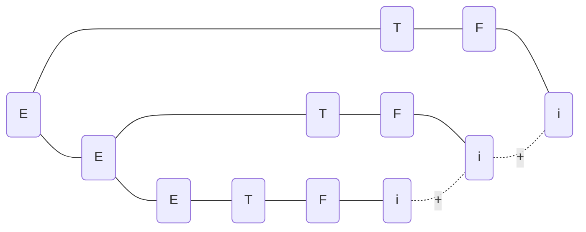
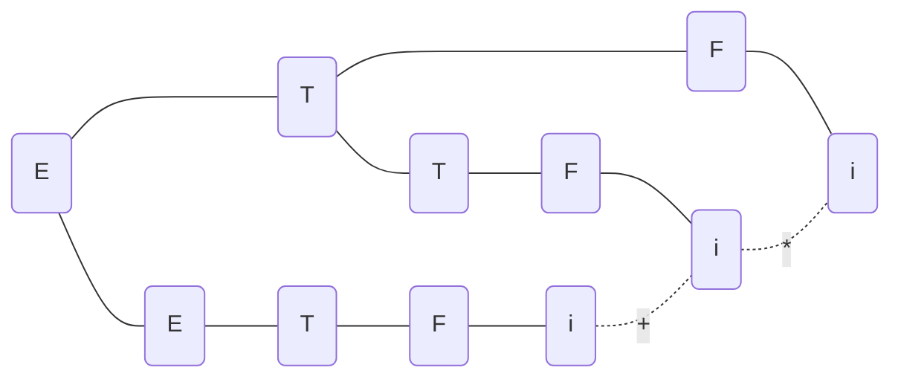
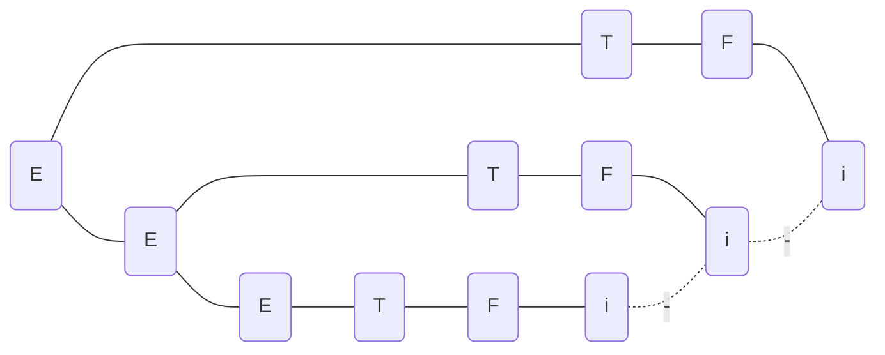

# 第二章 高级语言及其语法描述

<!-- GFM-TOC -->
* [第二章 高级语言及其语法描述](#第二章-高级语言及其语法描述)
    * [P36 6](#p36-6)
        * [题目](#题目)
        * [解答](#解答)
    * [P36 8](#p36-8)
        * [题目](#题目)
        * [解答](#解答)
    * [P36 9](#p36-9)
        * [题目](#题目)
        * [解答](#解答)
    * [P36 10](#p36-10)
        * [题目](#题目)
        * [解答](#解答)
<!-- GFM-TOC -->

## P36 6

### 题目

令文法为:

  

  

1. 的语言是什么?
2. 给出句子 0127、34 和 568 的最左推导和最右推导。

### 解答

1. 是由0\~9构成的数字串
2. 0127的最左推导
   

  

   0127的最右推导
   

  

   34的最左推导
   

  

   34的最右推导
   

  

   568的最左推导
   

  

   568的最右推导
   

  

## P36 8

### 题目

令文法为

1. 给出、的最左推导和最右推导;
2. 给出、和的语法树。

### 解答

的最左推导

  

的最右推导

  

的最左推导

  

的最右推导

  

的语法树

的语法树

的语法树

## P36 9

### 题目

证明下面的文法是二义的:

  

### 解答

最左推导:

  

  

最右推导:

  

  

## P36 10

### 题目

把下面的文法改写为无二义的:

  

### 解答

  

  
